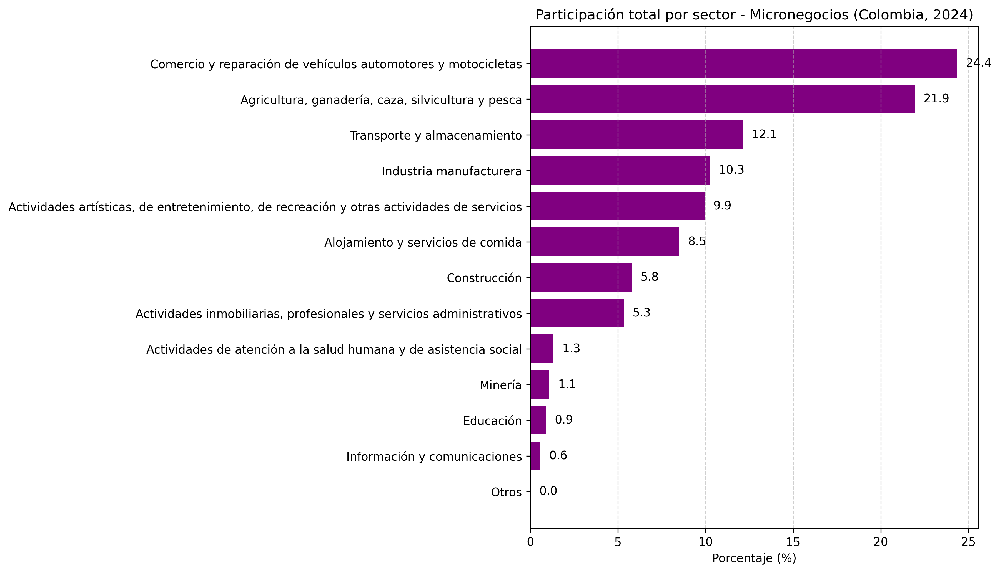
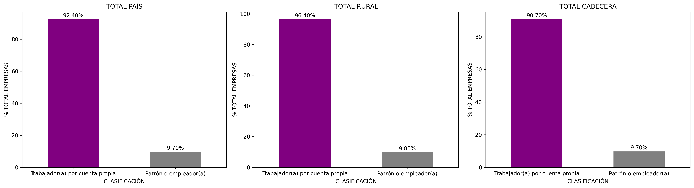
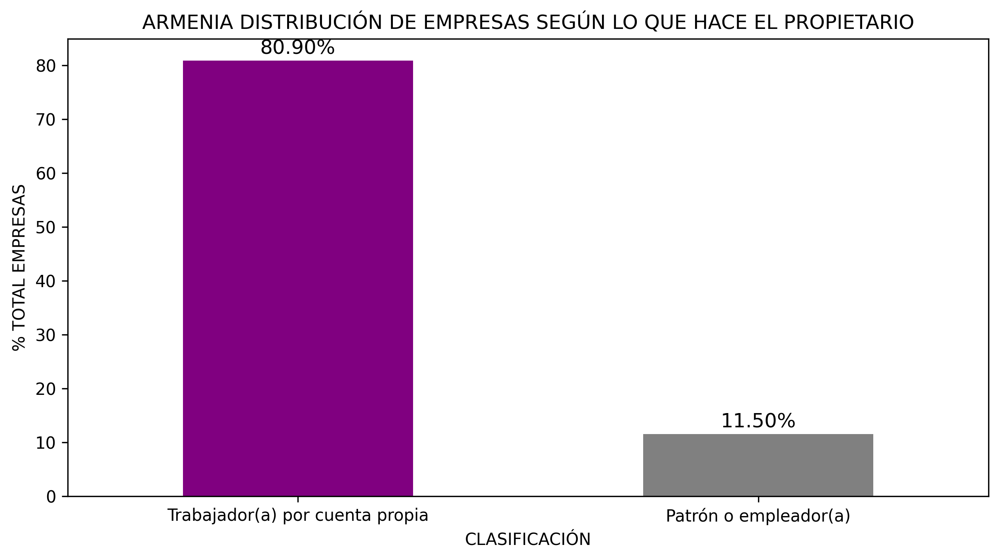
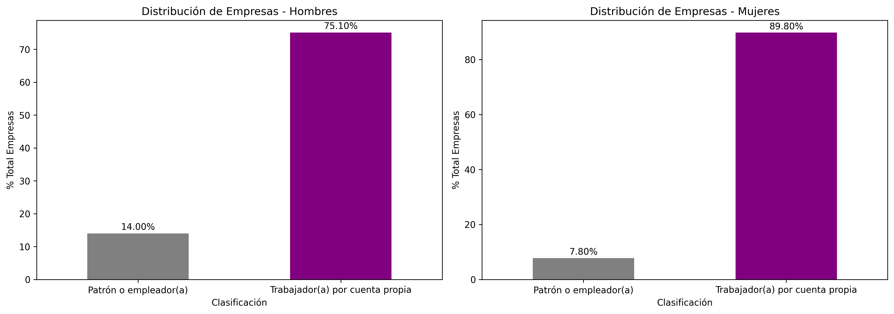
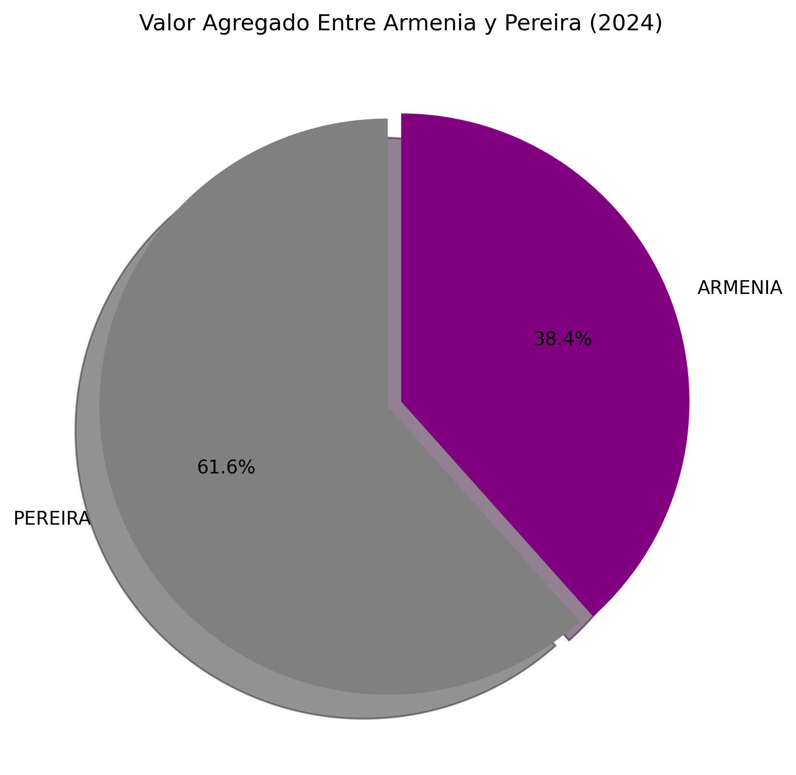

# Caracterización de Micronegocios en Colombia y el Quindio - EMICRON 2024

## Descripción

Este proyecto presenta un análisis exploratorio de datos sobre los micronegocios en Colombia y Armenia utilizando información de la Encuesta de Micronegocios (EMICRON) 2024 del DANE.

El análisis incluye variables relacionadas con:
- ingresos
- actividad económica
- ubicación geográfica
- características del propietario
- personal ocupado

## Fuente de datos

La información utilizada proviene de la Encuesta de Micronegocios (EMICRON) 2024 del Departamento Administrativo Nacional de Estadística (DANE).

La EMICRON es una operación estadística orientada a caracterizar la estructura y comportamiento de los micronegocios en Colombia.

La encuesta contiene información relacionada con:
- emprendimiento
- ubicación del negocio
- personal ocupado
- características del propietario
- TIC
- costos y gastos
- ingresos
- inclusión financiera

Debido al tamaño del dataset original, los archivos de datos no se incluyen en este repositorio.

## Herramientas utilizadas

- Python
- Pandas
- Dask
- dask_sql
- Matplotlib
- Jupyter Notebook

## Resultados

El proyecto incluye visualizaciones relacionadas con:
- distribución de ingresos
- actividades económicas
- características demográficas
- análisis territorial

## 📊 Resultados y Visualizaciones

Esta sección presenta los hallazgos principales sobre la dinámica de los micronegocios en 2024, comparando el panorama nacional con el contexto local de Armenia.

### 1. Panorama Nacional (Colombia 2024)

| Participación por Sector | Distribución por Zona |
| :---: | :---: |
|  |  |

Panorama Nacional: Estructura y Sectores
A nivel nacional, los micronegocios presentan una alta concentración en sectores tradicionales y una estructura de empleo muy específica.

Sectores Dominantes: El Comercio y reparación de vehículos (24.4%) y la Agricultura (21.9%) representan casi la mitad de los micronegocios en Colombia. Esto indica una economía de pequeña escala muy volcada a la subsistencia y al intercambio de bienes básicos.

Formalidad y Empleo: En todas las zonas (Rural, Cabecera y Total País), más del 90% de las unidades económicas son manejadas por "Trabajadores por cuenta propia". Esto sugiere que la mayoría de los micronegocios no generan empleo adicional, sino que son formas de autoempleo.

---

### 2. Análisis Específico: Armenia

#### **Perfil del Propietario**
> **Nota:** Se observa la distribución de micronegocios segmentada por sexo y ocupación del propietario.

* **Distribución General por Sexo**
.png)

* **Ocupación del Propietario (General vs. Por Sexo)**
A continuación, se detalla qué actividades realizan los propietarios y cómo varía según el género.

Contexto Local: Armenia (Quindío)
El análisis de Armenia revela matices interesantes sobre quiénes lideran estas unidades productivas.

Brecha de Género: Existe una mayoría masculina en la propiedad de micronegocios (60.3% hombres vs. 39.7% mujeres).

Diferencias en la Contratación: Los hombres tienen una mayor tendencia a ser "Patrones o empleadores" (14%) en comparación con las mujeres (7.8%).

Casi el 90% de las mujeres propietarias operan bajo la modalidad de cuenta propia, lo que podría reflejar barreras de crecimiento o una mayor carga de economía del cuidado que limita la expansión de sus negocios.

---

### 3. Comparativa Regional (Valor Agregado)
Finalmente, cerramos con el análisis de rendimiento económico comparado con ciudades pares.

Comparativa Regional: Valor Agregado
Este es uno de los puntos más críticos para el desarrollo económico local.

Armenia vs. Pereira: En la generación de valor agregado (la riqueza real que se genera tras descontar costos de producción), Pereira lidera con un 61.6% frente al 38.4% de Armenia.

Interpretación: Aunque ambas ciudades son cercanas, Pereira demuestra una mayor eficiencia productiva o una especialización en sectores con márgenes de ganancia más altos. Armenia tiene el reto de tecnificar sus micronegocios para cerrar esta brecha de productividad.

---
## 📌 Conclusiones

El análisis de la EMICRON 2024 permitió identificar diferencias importantes en la composición y características de los micronegocios en Colombia y Armenia.

Los resultados evidencian patrones relevantes en:
- participación sectorial,
- distribución territorial,
- características de los propietarios,
- y generación de valor agregado.

El proyecto demuestra el uso de herramientas de análisis de datos para el procesamiento, visualización e interpretación de información económica proveniente de fuentes oficiales del DANE.

## Autor
Marco Antonio Rolón Oliveros

# micronegocios-colombia-2024
Este repositorio contiene un análisis estadístico detallado sobre el panorama de los micronegocios, basado en los datos de la encuesta EMICRON. El proyecto busca identificar brechas de género, niveles de formalidad y la generación de valor agregado en la ciudad de Armenia en comparación con el promedio nacional y ciudades pares como Pereira.

